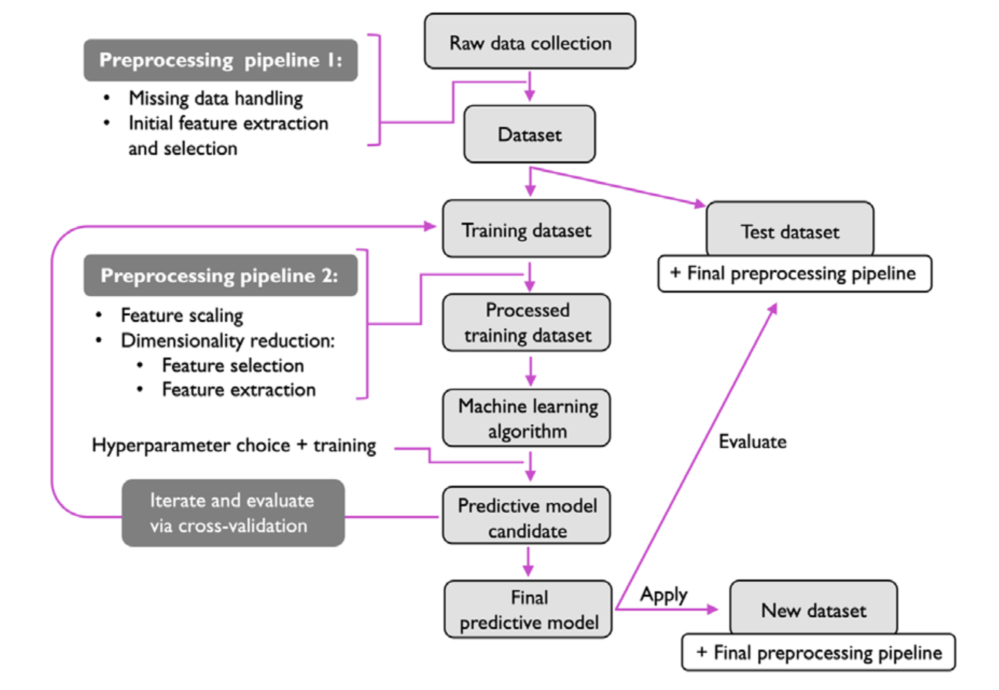

# Introduction to Machine Learning! 🚀

## What is Machine Learning? 🧠

Machine Learning is the art and science of programming computers to learn from data. 📊 It empowers computers to automatically learn and improve from experience without being explicitly programmed. 🌟 With Machine Learning, we can tackle complex problems and make sense of vast amounts of data, enabling us to make predictions, recognize patterns, and extract valuable insights.

## Why Learn Machine Learning? 🤔

Machine Learning is reshaping industries and revolutionizing the way we interact with technology. 🌐 Whether you're intrigued by self-driving cars, personalized recommendations, or predictive analytics, mastering Machine Learning opens doors to endless possibilities. 💡 Moreover, it's one of the most sought-after skills in today's job market, offering exciting career opportunities and lucrative prospects.

## Different types of ML 📚

- **Supervised Learning**: Teaching machines to learn from labeled data.
- **Unsupervised Learning**: Unraveling hidden patterns in unlabeled data.
- **Deep Learning**: Delving into neural networks and their applications.
- **Reinforcement Learning**: Training agents to make sequential decisions through trial and error.
- **And much more!**

### 1. Supervised Learning 🎓

Supervised Learning involves training a model on a labeled dataset, where each input is associated with a corresponding output label. The goal is to learn a mapping from inputs to outputs. In traditional programming, this is akin to providing explicit rules or instructions for the computer to follow.

**Example:** 
- Predicting house prices based on features like area, number of bedrooms, and location.

**Correlation with Traditional Programming:** 
- In traditional programming, this would be like providing a set of rules for determining house prices based on predefined criteria.

### 2. Unsupervised Learning 🧩

Unsupervised Learning involves discovering patterns or structures within unlabeled data. The model aims to identify inherent relationships or groupings in the data without explicit guidance. Contrastingly, in traditional programming, the rules are explicitly defined by the programmer.

**Example:** 
- Clustering similar customer segments based on their purchasing behavior.

**Correlation with Traditional Programming:** 
- In traditional programming, this would require predefined rules for categorizing customers into different segments based on specific criteria.

### 3. Deep Learning 🧠

Deep Learning is a subset of Machine Learning that uses artificial neural networks with multiple layers to extract features from data. These models are capable of learning complex patterns and representations, similar to how humans process information. In traditional programming, the complexity of such tasks would necessitate a large number of explicit rules.

**Example:** 
- Image recognition tasks, such as identifying objects in photographs.

**Correlation with Traditional Programming:** 
- Traditional programming for image recognition would involve manually specifying rules for detecting edges, shapes, and other visual features.

### 4. Reinforcement Learning 🎮

Reinforcement Learning involves training agents to make sequential decisions through trial and error, guided by a reward signal. The agent learns to maximize cumulative rewards over time by exploring different actions and their consequences. In contrast, traditional programming would require explicitly defining decision trees or flowcharts for each possible scenario.

**Example:** 
- Teaching a robot to navigate a maze by rewarding successful movements and penalizing errors.

**Correlation with Traditional Programming:** 
- Traditional programming for maze navigation would involve creating a detailed set of instructions for the robot's movement based on its current position and surroundings.

## Typical workflow for a ML system

A typical traditional ML workflow starts from 

1. Data pre processing pipeline
   
   1. Understanding the business requirements for which ML solution can fit best
   2. Data collection (usually in collaboration with domain experts using automated/manual data extraction techniques)
   3. Exploratory data analysis (understanding the pattern and correlations for accurate cleaning/feature extraction action in subsequent steps)
   4. Data curation (data cleaning, feature extraction and selection)

2. Feature extraction pipeline

   1. Feature scaling (to align all the features under 1 scale)
   2. Dimensionality reduction ( if there are high number of features, and are repeatative/highly correlated or are usless for target prediction, they are removed or new features can also be created ex: ratios of 2|3 features)

3. Model selection and training 
   1. Model selection depends on the data being fed ,by observing various correlation graphs, we can chose a bunch of models to try ( Which models to chose ? There is a very interesting theorem *No free lunch theorem* which states that 
   
   *There is no one algorithm that works best for every problem. In other words, there is no universal superior algorithm that outperforms all others across all possible scenarios. This theorem underscores the importance of understanding the characteristics of different algorithms and selecting the most appropriate one based on the specific problem at hand.*)

   This algorithm was stated in a paper (The Lack of A Priori Distinctions Between Learning Algorithms, D.H. Wolpert, 1996; No free lunch theorems for optimization, D.H. Wolpert and W.G. Macready, 1997)

   2. Identifying model metrics: Before we can compare different models, we first have to decide upon a metric to measure performance. One commonly used metric is classification accuracy, which is defined as the proportion of correctly classified instances.

