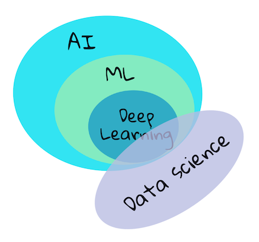

# Introduction

The term 'machine learning' is one of the most popular and frequently used terms of today.

Machine learning, from a systems perspective, is defined as the creation of automated systems that can learn hidden patterns from data to aid in making intelligent decisions.

This motivation is loosely inspired by how the human brain learns certain things based on the data it perceives from the outside world.

## Artificial Intelligence

The [human brain](https://www.livescience.com/29365-human-brain.html) perceives information from the real world, processes it, makes rational decisions, and takes actions based on the situation. 

We call this process "intelligent behavior." When we create computer programs that mimic this intelligent behavior in machines, we call it **artificial intelligence (AI)**.

## Machine Learning

**Machine learning** is a subfield of AI that focuses on building algorithms that can learn patterns from data and make predictions or decisions without being explicitly programmed.

**Machine learning is different than traditional programming:**

- Instead of writing explicit instructions for a computer to follow, we provide data and examples to train a model to make predictions or decisions.
- The model learns the patterns in the data and makes predictions or decisions based on those patterns.

**How does the model learn?**

- First, we understand the data and see patterns between features and target, we create a hypothesis (an educated guess) about the relationship between features and target. (Example: We may hypothesize that the relationship between features and target is linear, which means that the target is a straight line.)
  
- To test this hypothesis, we fit the model with a set of data (training data) for which we already know the outcome. (Example: We may use a dataset that includes the number of hours studied and the exam score to train the model.)
  
- The way we do fitting is by something called as **Gradient Descent** algorithm, 
  - Which basically starts with some random values of parameters 
  - Then take up input values and calculate the initial output using the hypothesis we created, 
  - Compare it with the desired output (loss) 
  - Then adjust the parameters to bring the model output closer to the desired output
  - Repeat this process for multiple iterations until the model converges to the best values of parameters that fit the data (Means the loss between the predicted output and desired output goes to minimum).
  
- Once the model is trained, we can use it to make predictions on new data. 
- We keep testing the model on the data to see if it is performing well. 
- We keep repeating the process until we have a model that is performing well on the data.

## AI, ML, Deep Learning

## Concepts

In this course, we will cover **'classical machine learning'** primarily using **Scikit-learn**, an excellent library many students use to learn the basics. To understand broader concepts of artificial intelligence or deep learning, a strong fundamental knowledge of machine learning is indispensable

### What is not covered?

- deep learning
- neural networks
- AI

To make for a better learning experience, we will avoid the complexities of neural networks, 'deep learning' - many-layered model-building using neural networks.

### Machine Learning Workflow

The process of creating machine learning (ML) models involves these key steps:

1. **Define the problem**: Formulate a specific question that requires ML to answer.
2. **Prepare data**: Collect, clean, and organize relevant data. This includes:
   - Collecting data from reliable sources
   - Cleaning and normalizing the data
   - Splitting data into training and testing sets
3. **Feature Engineering**: Create new features from the existing features or remove features that are not relevant to improve the performance of the model.
4. **Choose a model**: Select an appropriate ML algorithm based on your problem and data.
5. **Train the model**: Use training data to teach the model patterns.
5. **Evaluate**: Test the model's performance on unseen data.
6. **Tune**: Adjust model parameters to improve performance.
7. **Predict**: Use the model to make predictions on new data.
8. **Deploy**: Deploy the model to a production environment.
9. **Feedback**: Gather feedback from the predictions and repeat the process. 

#### Define the problem
Define the problem you want to solve with machine learning in detail. Consult domain experts, customers, and stakeholders to understand the problem and define success criteria in terms of important **customer metrics** (e.g., time savings, cost savings, revenue increase, customer satisfaction).

Determine the type of machine learning problem you're dealing with: classification, regression, clustering, or anomaly detection.

1. **Classification**: Predict a discrete label or category from  fixed a set of categories. Example: Email spam filter, predicting whether an email is spam or not.
2. **Regression**: Predict a continuous numerical value. Example: Predicting the price of a house based on its features.
3. **Clustering**: Group similar data points together. Example: Customer segmentation.
4. **Anomaly Detection**: Identify unusual patterns or outliers in data. Example: Fraud detection.

Depending on the type of problem, you can categorize the machine learning problems into

1. **Supervised learning**: The machine learning model is trained on labeled data. The labeled data is data that has a known output value. Example: Predicting whether an email is spam or not.
2. **Unsupervised learning**: The machine learning model is trained on unlabeled data. The unlabeled data is data that does not have a known output value. Example: Customer segmentation.
3. **Semi-supervised learning**: The machine learning model is trained on a combination of labeled and unlabeled data. Example: Fraud detection.
4. **Reinforcement learning**: The machine learning model is trained on a combination of labeled and unlabeled data. Example: Fraud detection.

Then you need to define the **Machine Learning Metric** that you will use to evaluate the performance of the model. It could be accuracy, precision, recall, F1 score, etc.

- **Accuracy**: The percentage of correct predictions.
- **Precision**: The percentage of true positives out of all predicted positives.
- **Recall**: The percentage of true positives out of all actual positives.
- **F1 Score**: The harmonic mean of precision and recall.  

| **Metric**  | **Definition**                                                                                       | **Formula**                                                                                               | **Example**                                                                                              |
|-------------|-------------------------------------------------------------------------------------------------------|-----------------------------------------------------------------------------------------------------------|----------------------------------------------------------------------------------------------------------|
| **Accuracy**| The ratio of correctly predicted observations (both positive and negative) to the total observations.  | (TP + TN) / (TP + TN + FP + FN)                                                                            | If out of 100 cases, 90 are predicted correctly, accuracy is 90%.                                         |
| **Precision**| The ratio of correctly predicted positive observations to the total predicted positives (true + false).| TP / (TP + FP)                                                                                             | If the model predicts 70 as positive and 60 are correct, precision is 60/70 = 85.7%.                     |
| **Recall**  | The ratio of correctly predicted positive observations to all observations in the actual class.        | TP / (TP + FN)                                                                                             | If there are 80 actual positives and 60 are correctly identified, recall is 60/80 = 75%.                  |
| **F1-Score**| The weighted average of Precision and Recall, best when there's an uneven class distribution.          | 2 * (Precision * Recall) / (Precision + Recall)                                                            | If precision is 85.7% and recall is 75%, F1-Score = 2 * (0.857 * 0.75) / (0.857 + 0.75) = 80.0%.          |

**Terms:**
- **TP (True Positive):** Correctly predicted positive cases.
- **TN (True Negative):** Correctly predicted negative cases.
- **FP (False Positive):** Incorrectly predicted as positive (Type I error).
- **FN (False Negative):** Incorrectly predicted as negative (Type II error).

**Example Scenario:**  
- 100 samples: 80 positives and 20 negatives.  
- Model predicts 70 positives, of which 60 are correct. It also predicts 30 negatives, of which 20 are correct.

#### Collect data

👉 Collect data relevant to the problem you're trying to solve

👉 Determine the amount of data needed

👉 Assess data quality

👉 Determine if the data is structured or unstructured

👉 Identify data sources and evaluate their:
- Reliability
- Potential biases
- Diversity
- Representativeness of the real world

#### Clean data

Real world data is messy. To clean the data:

👉 Remove duplicates

👉 Handle missing values

👉 Normalize the data

👉 Convert data into a suitable format for the machine learning model

👉 Represent data in a way the model can understand

Perform Exploratory Data Analysis (EDA) to better understand the data:

👉 Look for outliers

👉 Identify missing values

👉 Detect duplicates

Additional data preparation steps:

👉 Normalize the data

👉 Convert data into a format suitable for the chosen machine learning model

#### Feature Engineering

Feature engineering is the process of selecting and transforming features (variables) to improve the performance of your machine learning model.

👉 Create new features from the existing features to improve the performance of the model.

👉 Drop the features that are not relevant.

👉 Scale the features, convert the features into a format that is suitable for the machine learning model you are using.

> **Note**: Feature engineering is an iterative process. You would do it multiple times to get the best features for the model, depending on the performance of the model on the validation data.

#### Split data   

Now is the time to:

👉 Have a dataset that is representative of the real world, that model is going to see.

👉 Have a dataset that can validate the model's performance.

To do this, you need to split the data into training and testing sets. You need to make sure that the data is split in a way that the model has not seen the testing data before.

#### Choose a model

Before you start building a model, you need to first select the type of model you are going to build. 

Depending the type of problem, you would start with a simple model and then keep adding complexity to the model as needed.

**Example**:

👉 For a classification problem, you would start with a simple model like **logistic regression.**  

👉 For a regression problem, you would start with a simple model like **linear regression**.

👉 For a clustering problem, you would start with a simple model like **k-means**.

👉 For an anomaly detection problem, you would start with a simple model like **isolation forest**.

To understand the model to start with, you would want to visualize the data distribution and correlations between the features. What patterns are being shown by the data (Ex: Are they linear or non-linear ?), based on that you want to select your hypothesis and then choose the appropriate model to start with.

> **Note** This is again an iterative process. You would start with a simple model and then keep adding complexity to the model as needed.

#### Train the model

👉 Train the model on the training data
  - This process finds the best parameters for the model

👉 Optimize model performance:
  - Experiment with hyperparameters
  - Play with feature selection and engineering  
  - Try different models to find the best performer

👉 Consider ensemble learning
  - Group multiple models together for improved performance

👉 Iterate through the process:
  - Continuously refine the model based on performance metrics
  - Adjust parameters, features, or model selection as needed

#### Evaluate the model

Evaluate the model's performance on the testing data. Make sure that the model is not overfitting or underfitting. Look at the metrics like accuracy, precision, recall, F1 score, etc and keep monitoring the metrics on the validation data as you are training the model.

- **Overfitting**: When a model performs too well on training data but poorly on new data.
- **Underfitting**: When a model performs poorly on both training and new data.

#### Tune the model

This is the optimization step, you would look at model metrics on training and test sets and make a decision to do adjustmnents in model hyperparameters, feature engineering, feature selection, or even select a different model altogether.

#### Predict

Once you are satisfied with the metrics and has achieved the target performance, you can use the model to make predictions on new data.

#### Deployment

Once you have a model that is performing well, you can deploy it to a production environment. This could be a web application, a mobile application, or an API, you need to decide on feedback collecting strategy from the application and use the feedbacks to retrain the model, compare with the previous versions and decide if the retrained model is performing well and then only you can deploy it to production.

#### Feedback

With time, we may see the drift in the data distribution, data may become biased, or the model may start performing poorly. You need to keep monitoring the performance and keep retraining the model to keep it updated.  

### Key Concepts

- **Features (X)**: Input variables used to train the model. These are measurable properties of your data, often represented as column headings in datasets.
- **Target (y)**: The variable you're trying to predict, representing the answer to your question.
- **Feature Selection**: Process of choosing the most relevant features for your model.
- **Data Visualization**: Using tools like Seaborn or MatPlotLib to uncover hidden correlations and potential biases in your data.
- **Overfitting**: When a model performs too well on training data but poorly on new data.
- **Underfitting**: When a model performs poorly on both training and new data.