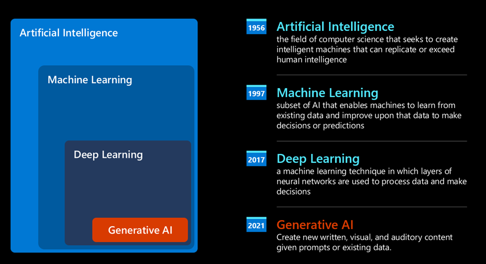

# Generative AI

Generative AI is artificial intelligence capable of <mark>generating text, images and other types of content </mark>. 

What makes it a fantastic technology is that it democratizes AI, <mark>anyone can use it with as little as a text prompt. A sentence written in a natural language.</mark> 

There's no need for you to learn a language like Java or SQL to accomplish something worthwhile, <mark>all you need is to use your language, state what you want and out comes a suggestion from an AI model</mark>.

The applications and impact for this is huge, you write or understand reports, write applications and much more, all in seconds.

## Timeline

Source: https://www.brilworks.com/blog/evolution-of-generative-ai/

### What led to rapid evolution of generative AI ?

👉 **<mark>Advances in computing power</mark>**, including the development of GPUs (Graphics Processing Units) and specialized hardware like TPUs (Tensor Processing Units), have enabled the training of large-scale generative models more efficiently.

👉 The proliferation of the internet and digital data has provided **<mark>vast amounts of training data for AI systems</mark>**. This allows generative models to learn and produce more accurate outputs.

👉 **<mark>Continuous improvements in generative AI algorithms</mark>** and training techniques have played a significant role. Techniques such as attention mechanisms, self-attention, and reinforcement learning have contributed to the effectiveness of generative models.

Advances in natural language processing research have been crucial for text generation tasks. 

## Modules

:::: {grid} 1 2 3 4
:margin: 0
:gutter: 0

::: {card} 1️⃣ Prompt Engineering
:link: ../genai/prompt-engineering/intro.html
:link-type: url
:shadow: md
:margin: 3
:text-align: center
:::

::: {card} 2️⃣ Langchain
:link: ../genai/langchain/intro.html
:link-type: url
:shadow: md
:margin: 3
:text-align: center
:::

::: {card} 3️⃣ RAG **(Coming Soon)** ⌛
:link: ../genai/RAG/intro.html
:link-type: url
:shadow: md
:margin: 3
:text-align: center
:::

::: {card} 4️⃣ Agents **(Coming Soon)** ⌛
:link: ../genai/agents/intro.html
:link-type: url
:shadow: md
:margin: 3
:text-align: center
:::

::: {card} 5️⃣ LLM Recipes **(Coming Soon)** ⌛
:link: ../genai/llm-recipes/intro.html
:link-type: url
:shadow: md
:margin: 3
:text-align: center
:::

::: {card} 6️⃣ Evaluations **(Coming Soon)** ⌛
:link: ../genai/evaluations/intro.html
:link-type: url
:shadow: md
:margin: 3
:text-align: center
:::
::::

## How Generative AI works

Take a look into an awesome explaination from the blog **Generative AI exists because of the transformer**

<iframe src="https://ig.ft.com/generative-ai/" width="100%" height="600px" frameborder="0" allowfullscreen/>