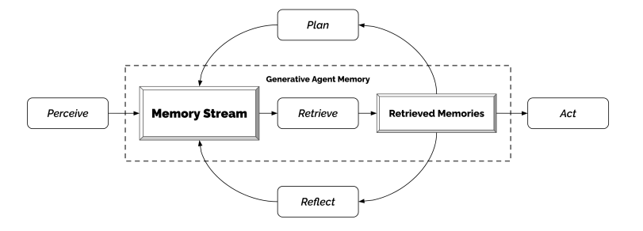

# A society of Generative AI agents !

Imagine, you visit a place where a group of bots have created a society of their own. They have their own shops, homes, schools and they interact with knowns and unknowns, build relationships, do get-togethers, plan a party or say they create an entire ecosystem of their own just like humans do. It may be hard to imagine but fun to think of.

It used to look like a science fiction few years back, it might still look like one for some, but in the age of Generative AI, everything is possible.  

Few months back, a group of researchers published a paper titled “**Generative Agents: Interactive Simulacra of Human Behavior**”, talks about how a group of generative agents can act like humans and interact with surroundings just like human beings do and create a believable proxies of human behavior using the power of LLM.

These believable human proxies or say generative agents ,in a simulated environment wake up, cook breakfast and head to work; artists paint, while authors write; they form opinions , notice each other, and initiate conversations; they remember and reflect on days past as they plan the next day. Isn’t it fascinating!

This experiment can empower interactive applications ranging from immersive environments to rehearsal spaces for interpersonal communication , prototyping tools to User Experience testing without actually involving a human being.  
  
So, how can all this be achieved ? This paper proposes an architecture which extends LLMs to store complete record of agent’s experiences using natural language, synthesize those memories over time into higher level reflections and retrieve them dynamically to plan a behavior at any instance.  

A simulated environment is created consisting of say 25 generative agents. Now an end user interacts with this environment using natural language and gives a scenario for the agents to work on. Say, one agent wants to throw a Valentine’s Day party, the agents then autonomously spread invitations to the party over the next two days, make new acquaintances, ask each other out on dates to the party, and coordinate to show up for the party together at the right time.

Such simulations which can mimic human behaviors can populate virtual spaces and communities with realistic social phenomena, they can:

1. Train people on how to handle rare yet difficult interpersonal situations
2. Test social science theories
3. Craft model human processors for theory and usability testing
4. Power ubiquitous computing applications and social robots and
5. Underpin non-playable game characters that can navigate complex human relationships in an open world

  

However, understanding human behavior is vast and complex. Although there has been progress in creating LLMs that can mimic human behavior at a single moment in time, but creating fully functional agents that can manage memories that constantly grow as new interactions, conflicts, and events arise and fade over time has to be developed.

These agents also need to handle the complex social dynamics that occur between multiple agents.  
To be successful, an approach is needed that can retrieve relevant events and interactions over a long period of time, reflect on those memories to generalize and draw higher-level conclusions, and use that reasoning to create plans and responses that make sense in the moment and in the agent's long-term behavior.  
  

Generative agents infer about themselves, other agents, and their environment, create daily plans, react, and re-plan when necessary. They respond to changes in the environment and follow commands in natural language.

The agent architecture includes three modules.

1. The first module is the memory stream, which records a comprehensive list of the agent's experiences in natural language.
2. The second module is reflection, which synthesizes memories into higher-level inferences over time, enabling the agent to draw conclusions about itself and others.
3. The third module is planning, which translates conclusions and the current environment into high-level action plans, then recursively into detailed behaviors for action and reaction. Reflections and plans are fed back into the memory stream to influence future behavior.

This has applications in multiple domains, including social role-play scenarios and prototyping social platforms for dynamic, complex interactions that unfold over time.

  
End users and developers can interact with generative agents to host in-game events like Valentine's Day parties without the need for manually scripting the behavior of multiple characters. By simply telling one agent to throw a party, our agents successfully organize and spread the word about the event, even going as far as to invite other agents and ask them to attend. All of this is achieved from a single user-generated idea, despite the potential for numerous points of failure.  

  
  
**Read the original paper here** : [https://arxiv.org/abs/2304.03442](https://arxiv.org/abs/2304.03442)

**Simulated environment:** [https://github.com/joonspk-research/generative_agents](https://github.com/joonspk-research/generative_agents)