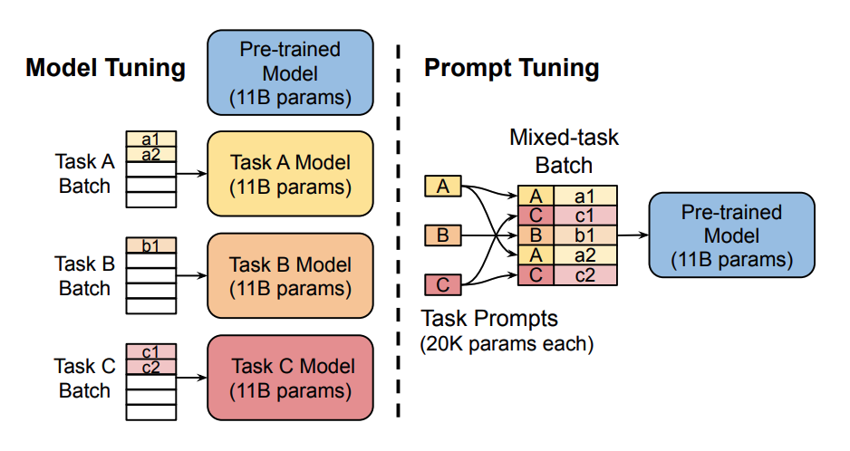

# Prompt Tuning

Training large pretrained language models is very time-consuming and compute-intensive. As they continue to grow in size, there is increasing interest in more efficient training methods such as _prompting_.

Prompting primes a frozen pretrained model for a specific downstream task by including a text prompt that describes the task or even demonstrates an example of the task. With prompting, you can avoid fully training a separate model for each downstream task, and use the same frozen pretrained model instead. This is a lot easier because you can use the same model for several different tasks, and it is significantly more efficient to train and store a smaller set of prompt parameters than to train all the model’s parameters.

There are 2 categories of Prompting methods:
1. **Hard prompts**: manually handcrafted text prompts with discrete input tokens; the downside is that it requires a lot of effort to create a good prompt
2. **Soft prompts** : - soft prompts are **learnable tensors** concatenated with the input embeddings that can be optimized to a dataset; the downside is that they aren’t human readable because you aren’t matching these “virtual tokens” to the embeddings of a real word.

